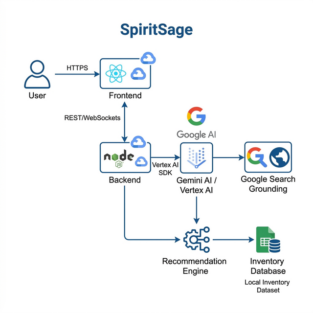

# 🍸 SpiritSage - Virtual Sommelier & Discovery Engine

SpiritSage is a next-generation AI-powered liquor recommendation app built for the **Gemini Multimodal Live Challenge**. It features a real-time, voice-activated "Virtual Sommelier" that helps users discover spirits through natural conversation, visual food pairing, and viral trend discovery.

---

## 🚀 Live Demo
**[Launch SpiritSage Lite](https://spiritsage-frontend-447843351231.us-central1.run.app/)**

---

## ✨ Features
- **Multimodal Live Agent**: Real-time voice interface with Gemini 2.0 Flash for tasting notes and food pairings.
- **Barge-In Capabilities**: Instant local Voice Activity Detection (VAD) allows for seamless interruptions.
- **Viral Trend Discovery**: Grounded Google Search for trending cocktails (TikTok/Instagram) matched to local inventory.
- **Hybrid Search**: Blazing fast fuzzy matching combined with on-device Semantic Search (Transformers.js).
- **Premium UX**: Liquid gradients, glassmorphism, and category-aware styling.

---

## 🧠 Technical Architecture



### 1. Hybrid Search Architecture
SpiritSage utilizes a dual-engine approach:
- **Levenshtein Fuzzy Matching**: Handles direct brand searches and typos.
- **Semantic Search Engine**: Powered by **Transformers.js** with the `all-MiniLM-L6-v2` model running locally via WebAssembly. Cosine similarity maps vague queries (e.g., "rainy night") to conceptual flavor tags.

### 2. Live Agent Interaction
- **WebSocket Gateway**: A Node.js bridge connects the React frontend directly to the **Gemini Multimodal Live API**.
- **Optimization**: We use a custom PCM audio worklet for low-latency playback and local RMS-based energy detection for zero-delay interruptions.

---

## 🛠️ Local Spin-Up Instructions

### Prerequisites
- **Node.js 18+**
- **Google Cloud Project** with the **Gemini 2.0 Flash** API enabled.
- **Gemini API Key** from [Google AI Studio](https://aistudio.google.com/).

### 1. Clone & Install
```bash
git clone <your-repo-url>
cd spiritsage-lite
npm install
cd server && npm install && cd ..
```

### 2. Environment Setup
Create a `.env` file in the root directory:
```env
GEMINI_API_KEY=your_api_key_here
PORT=8080
```

### 3. Run Locally
We use a two-process setup (Frontend + Backend Proxy):

**Start Backend (Port 8080):**
```bash
node server/index.js
```

**Start Frontend (Vite):**
```bash
npm run dev
```
Open [http://localhost:5173](http://localhost:5173) to interact with the app.

---

## ☁️ Cloud Deployment Guide

SpiritSage is designed for **Google Cloud Run**.

### 1. Build and Test
```bash
npm run build
```

### 2. Deploy via gcloud CLI
Ensure you have the [Google Cloud SDK](https://cloud.google.com/sdk) installed and authenticated.

```bash
# Set your project ID
gcloud config set project [YOUR_PROJECT_ID]

# Deploy the service
# Our included deploy.sh automates the container build and push
./deploy.sh
```

### 3. Cloud Infrastructure Notes
- **Compression**: The backend uses Express `compression` to fit the large semantic model and assets within the Cloud Run response limits.
- **WebSockets**: Cloud Run must have "Sticky Sessions" or sufficient timeout configurations (handled automatically by our deploy script).

---

## 🛡️ Proof of Google Cloud Deployment
- **Backend API**: [https://spiritsage-backend-447843351231.us-central1.run.app/health](https://spiritsage-backend-447843351231.us-central1.run.app/health)
- **Vertex AI / Gemini Integration**: See [`server/index.js`](server/index.js) lines 380-550 for the Live WebSocket implementation using the `@google/genai` SDK.
- **Grounding Service**: See [`server/index.js`](server/index.js) lines 98 for Google Search Tool integration.

---

## 🧪 Testing & Verification

We have included several reproducible tests to verify the core logic of the SpiritSage engine.

### 1. Automated Search Engine Test
Verify the fuzzy matching and recommendation logic for complex queries (e.g., "Full-Bodied Wine"):
```bash
# From the root directory
node test_recommend_wine.mjs
```
*Expected: A console output showing a list of 24 filtered wine recommendations with specific scores.*

### 2. Semantic Intent Discovery
Test the on-device Transformers.js integration for concept-based searches (e.g., "mexican night"):
```bash
node testSemantic.mjs
```
*Expected: High-confidence similarity matches for Tequila and Mezcal entries.*

### 3. Live API Connectivity
Verify that the backend can successfully bridge to the Gemini Multimodal Live API:
```bash
# Check the health endpoint of the live production server
curl https://spiritsage-backend-447843351231.us-central1.run.app/health
```

### 4. Manual Barge-In Verification
To verify the "Interruption Robustness" judging criterion:
1. Open the Live Demo.
2. Click the **Microphone** to start a session.
3. Ask: "Tell me about a very complex, peaty Scotch."
4. **Interrupt** the AI while it's mid-sentence by saying "Wait, what about something cheaper?"
5. **Observed Result**: The audio should cut off **instantly** (within ~100ms) due to our local RMS-based VAD logic.

---

## 🛠️ Core Stack
- **AI**: Gemini 2.0 Flash (Multimodal Live API)
- **Frontend**: React, Vite, Lucide-React
- **Backend**: Node.js, Express, WS
- **Infra**: Google Cloud Run, GCR
- **Search**: Transformers.js, Fuse.js
